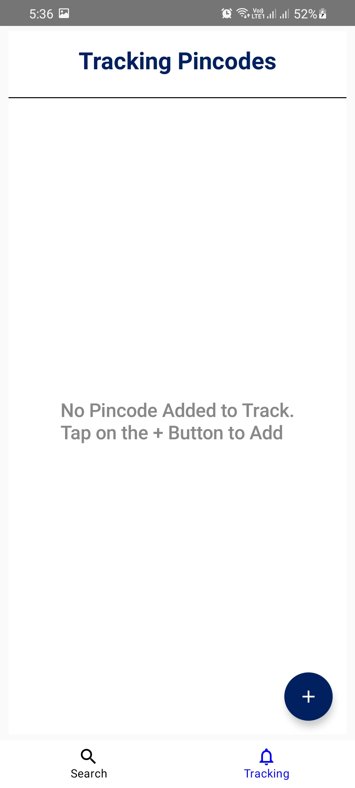

# Cowin Slot Tracker Android Application

* This App was made for helping the People getting the Vaccine Slots easily as soon as the Slots becomes available.

* The Android App lets the User add Pincodes to track and also the Age Group (i.e. 18+, 45+, or Both).
* The User can also search the Pincodes inside the App for easy viewing of the available slots. The
* The App is built with Jetpack Compose,Hilt and a Clean App Architecture(MVVM)
* For notifications, A Django backend is used with Celery-Beat Scheduler which schedules the tasks for searching the Pincode every 5 Minutes. If the Slot is Available it uses Firebase Cloud Messaging Service to send the message to the particular user which has subscribed to that Pincode.

[Backend Repository Link](https://github.com/samyakj2307/cowin-slot-tracker-backend)

# Demo Screenshots

 

## Home Screen

 

## Search Pincode

 

## Center Information

 

 

## Track Pincode Screen

 

## Add Pincode for Tracking

 

 

 

## Get Notifications

 

